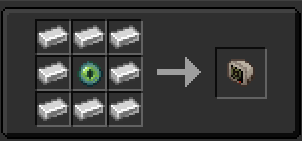

The **Monitor** is your way to change settings, customise your TARDIS and view TARDIS info.

A monitor is integrated within most TARDIS [**Consoles**](./console), but you can craft it as a separate block and use it anywhere in your interior rather than just your [**Console**](./console).

## Recipe

## Customizing Your TARDIS
In the monitor's GUI you can customise your TARDIS, like the Exterior, Desktop Theme, Hum, Vortex, etc.
 Check out the [**Customizing TARDIS**](../mechanics/tardis/customizing) page for details.

## Information on Monitor block
The information displayed on the Monitor's front face consists of:
- Current location at the top (marked with a ❌), divided into coordinates, dimension and direction the TARDIS is facing.
- Destination location below that (marked with a blue ➕), divided into coordinates, dimension and direction the TARDIS will be facing.
- A yellow fuel icon at the bottom, with a percentage next to it indicating how much [**Artron Energy**](../mechanics/artron) is left.
- A green hourglass below that, with a percentage next to it indicating flight progress.
- The name of the TARDIS in the lower right.
- A red alert icon in the top-right if alarms ar active.

## Monitor GUI
Interacting (right-clicking) on any monitor will open the monitor GUI.
The first screen of the GUI is split into four sections: Two on the left and two on the right.

<ins>Left sections:</ins>
- The top shows the current location, divided into coordinates, dimension and direction the TARDIS is facing.
- Right below that it shows the destination location, divided into coordinates, dimension and direction the TARDIS will be facing.
- The bottom section shows two bars and a button. The 5-segment display shows flight-progress, the bar below that displays how much [**Artron Energy**](../mechanics/artron) (in green) is left. The button next to these navigates to the **Settings Screen**.

<ins>Right sections:</ins>
- The top shows the currently selected exterior *type*, while the bottom shows the *variant* of that exterior. Clicking on the left and right arrow buttons browses through the various types and variants. Pressing the "Apply" button sets the currently selected type and variant as your TARDIS' new exterior.

## TARDIS Settings Customisation
Clicking the button next to the Artron energy bar will open the settings screen.
This screen is also split into four sections: Two on the left and two on the right.

<ins>Left section:</ins>
- The top shows various menu entries.
  - **Cache Console**: Will replace your [**Console**](./console) with a **Console Generator** in order for you to either move the console and/or choose a different console type (and/or variant).
  - **Security Options**: As the name suggests, this allows you to set various options related to security, see the [**Security Protocols**](../mechanics/tardis/security) page for more info.
  - **Sonic Settings**: Shows you info about the Sonic Screwdriver that is currently plugged into the console and also allows you to change the **Sonic Shell**. See the [**Sonic Screwdriver**](../items/sonic) page for more info.
- The bottom shows the 5-segment display for flight-progress and a bar to indicate how much Artron energy is left, just like in the main screen. The button next to it will lead back to the main screen.

<ins>Right section:</ins>
- The top shows the currently selected **desktop theme** of the interior.
- The bottom shows the settings for **Hum**, **Vortex**, **Flight**, **Demat** and **Mat**. The arrow-buttons in the top-right corner browse through the settings, the arrow-buttons at the bottom browse through the options for the current setting. And the wide button in-between these arrow-buttons will apply the currently selected option for the selected setting.
  - **Hum**: Controls the hum ambient sound inside the interior of the TARDIS.
  - **Vortex**: Controls which texture to use for the Vortex.
  - **Flight**: Controls the travel-sound you can hear during flight.
  - **Demat**: Controls both the animation and sound of the dematerialization.
  - **Mat**: Controls both the animation and sound of the (Re)materialization.
