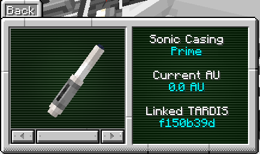

The Sonic Screwdriver is a handheld device used for various tasks, these tasks range from seeing what the console do, to blowing up TNT.

To **link** a Sonic Screwdriver to a [**TARDIS Console**](../../blocks/console) right-click on the **Sonic Port** whilst holding the Sonic Screwdriver. It should of now have gone into the **Sonic Port** and have linked to the **TARDIS**, to remove it punch the Sonic Screwdriver in the **Sonic Port**, and it will eject from the [**Console**](../../blocks/console).

To **charge** a Sonic Screwdriver insert it into a [**TARDIS Console**](../../blocks/console). Like you would for linking it then the Sonic Screwdriver should start charging (keep in mind the Sonic Screwdriver uses the [**Artron Energy**](../../mechanics/artron) to charge). 

After when you have done charging your Sonic Screwdriver punch the Sonic Screwdriver and it will come out of the **Sonic Port**.

## Recipe
Made with the Sonic Screwdrive Blueprint!

## Sonic Modes

The sonic has 5 modes, those being:

- Inactive (Powered Off)
- Interaction
- Overload
- Scanning
- TARDIS

#### Inactive Mode
**Inactive** mode renders the Sonic Screwdriver unusable, this will be used as a form of power saving mode for the Sonic Screwdriver.

#### Interaction Mode
**Interaction** mode allows the Sonic Screwdriver to ignite candles, campfires and unlit torches. It can also change repeaters delay and mode.

#### Overload Mode
**Overload** mode allows the Sonic Screwdriver to ignite TNT and toggle redstone lamps! It can also shatter glass blocks.

#### Scanning Mode
**Scanning** mode allows the Sonic Screwdriver to tell you what console controls are by hovering over the [**Control Entities**](../../blocks/console#how-do-i-use-a-tardis-console) and will show you the controls hitboxes. It will also confirm if you are located inside a [**Rift Chunk**](../../mechanics/rift-chunks) and how much [**Artron Energy**](../../mechanics/artron) is stored in that chunk.
In addition,hovering over a generalized subsystem core will tell you the durability of the subsystem that it holds if the circuit has durability. You can also scan blocks and entities for info such as; health, required mining tool, and blast resistance.

#### TARDIS Mode
**TARDIS** mode allows the Sonic Screwdriver to set the destination of the TARDIS wherever you right-click, as long as it's available to land, and deactivates the handbrake.
If you are within 256 blocks of the TARDIS exterior, the TARDIS will be summoned to the location of choice,however you do need the "PILOT" rank (loyalty),in addition looking up in the interior and using the sonic triggers demat and looking down activates the handbrake and refuels the TARDIS. When you are inside your Tardis and the sonic is linked to said Tardis (when its placed in your offhand) you can activate the sonic the tardis will takeoff.

## Sonic Settings & Configuration
By default, you receive the "Prime" when crafting it or by getting it from the creative menu but there is a way to modify the Sonic Screwdriver casing, check it's power, see what TARDIS it's linked to and what casing it has.

To change the sonic casing, right-click on the **Sonic Port** whilst holding the Sonic Screwdriver, then when it's in, go to the [**Monitor**](../../blocks/monitor) and click on **Settings** and click onto **Sonic Settings** now you will be able to view the Sonic Screwdriver's data but also the buttons for switching TARDIS Interiors & Exteriors. 

Pressing though them should allow you to change your Sonic Screwdriver to handfull of different cases (more can be added with [datapacks](../../datapacks/sonics)), clicking the button underneath the Sonic Screwdriver display should set it to that casing then punching the **Sonic Port** and it should give you back the Sonic Screwdriver.

## Sonic TARDIS Repair
After crashing your TARDIS, repairing it would take a while but there is an alternative to speed up the repair process and to do this hold your Sonic Screwdriver (in any mode you want it to be) and right click the **TARDIS Exterior**.

The Sonic Screwdriver should be inserted into the "keyhole" and start speeding up the TARDIS repair (usually the sped up repair process should take around 25 seconds) just like the the (Doctor WHO 60th 2nd Special Episode: Wild Blue Yonder).

If you right click the **TARDIS Exterior** when its repairing the Sonic Screwdriver will tell you how many seconds there is till the TARDIS repair has finished (This will not destroy your existing interior and replace it with a new one). 

Once the repair has finished the Sonic Screwdriver should pop out of the **TARDIS Exterior** (if not just shift+right-click and it will pop out) and the TARDIS is repaired for you to use again.

## Other Info
If you don't know what block can be interacted with a Sonic Screwdriver, make sure you have the Sonic Screwdriver in your hand and if you face a block (that can be interacted with a sonic then the crosshair should look a bit like the Sonic Screwdriver).

Some blocks would need to be interacted in the **Interaction** Mode or the **Overdrive** Mode.
***The sonic can be used to cancel out engine phasing aswell***

Once the Sonic Screwdriver runs out of charge it will be stuck on **Inactive** Mode till you have charged your Sonic Screwdriver in the **Sonic Port**!

Also if you put the **Sonic Screwdriver** (in **Scanning** Mode) in the **Sonic Port** then it would allow you to view which buttons need to be pressed for 
you to fly without crashing (**Flight Events**).

In addition if you look up the sonics pitch increases and if you look down the pitch decreases.
